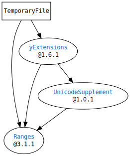

# What is `SwiftTemporaryFile`?

`SwiftTemporaryFile` provides functions related to temporary files.
It was originally written as a part of [SwiftCGIResponder](https://github.com/YOCKOW/SwiftCGIResponder).

# Requirements

- Swift 5
- macOS(>=10.15) or Linux


## Dependencies




# Usage

```Swift
import Foundation
import TemporaryFile

let tmpFile = TemporaryFile()
try! tmpFile.write(contentsOf: "Hello, World!".data(using:.utf8)!)
try! tmpFile.seek(toOffset: 0)
print(String(data: try! tmpFile.readToEnd()!, encoding: .utf8)!) // Prints "Hello, World!"
try! tmpFile.copy(to: URL(fileURLWithPath: "/my/directory/hello.txt"))

/*
You can explicitly close the temporary file by calling `try tmpFile.close()`,
though all of the temporary files are automatically closed at the end of program.
*/
```

```Swift
import TemporaryFile

// You can pass a closure:
TemporaryFile { (tmpFile: TemporaryFile) -> Void in
  try! tmpFile.write(contentsOf: "Hello, World!".data(using:.utf8)!)
  // ... 
} // Automatically closed.
```


# License

MIT License.  
See "LICENSE.txt" for more information.

